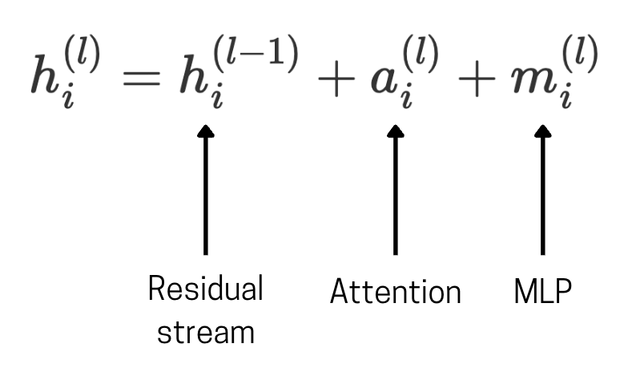
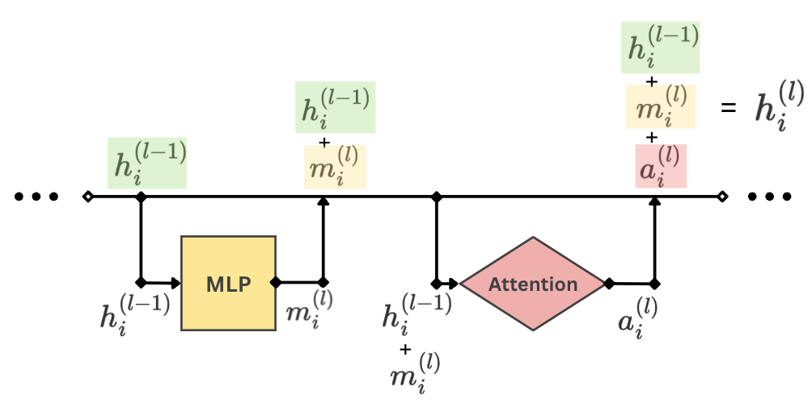
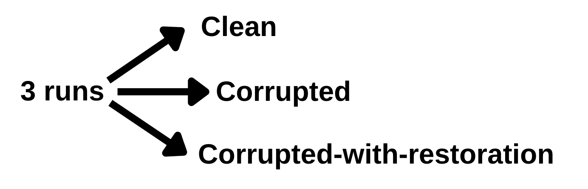
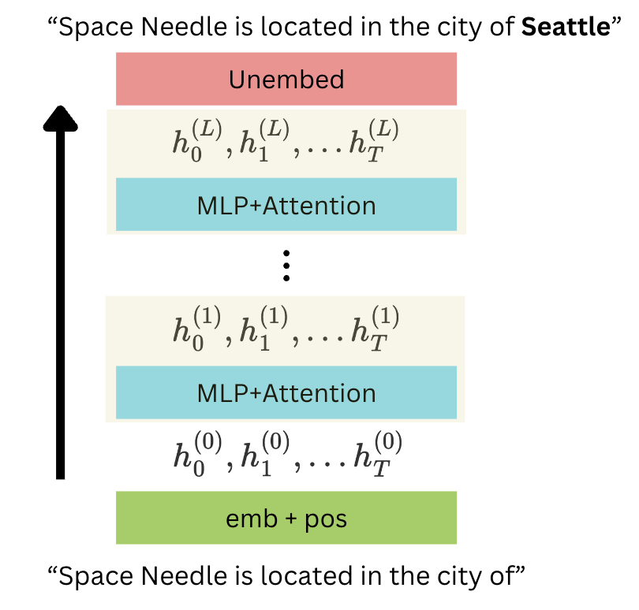
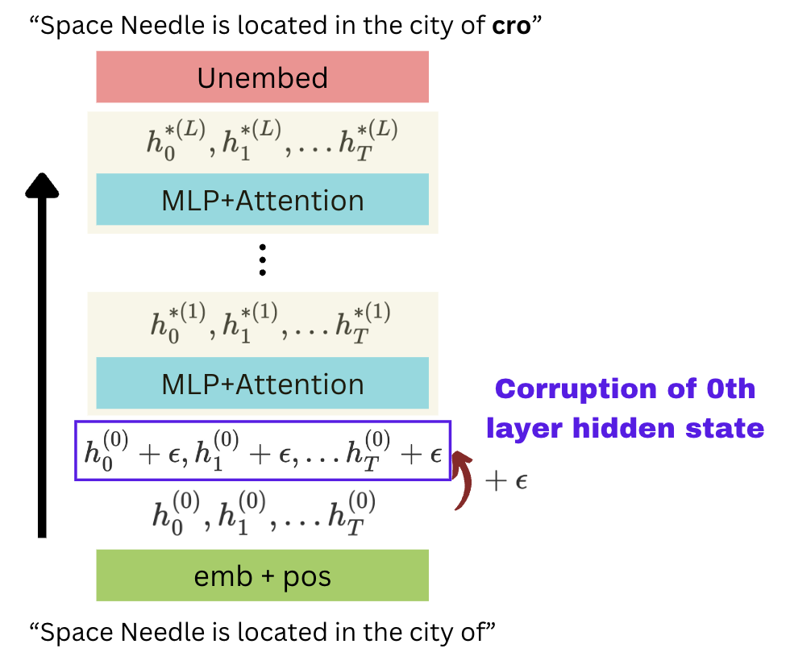
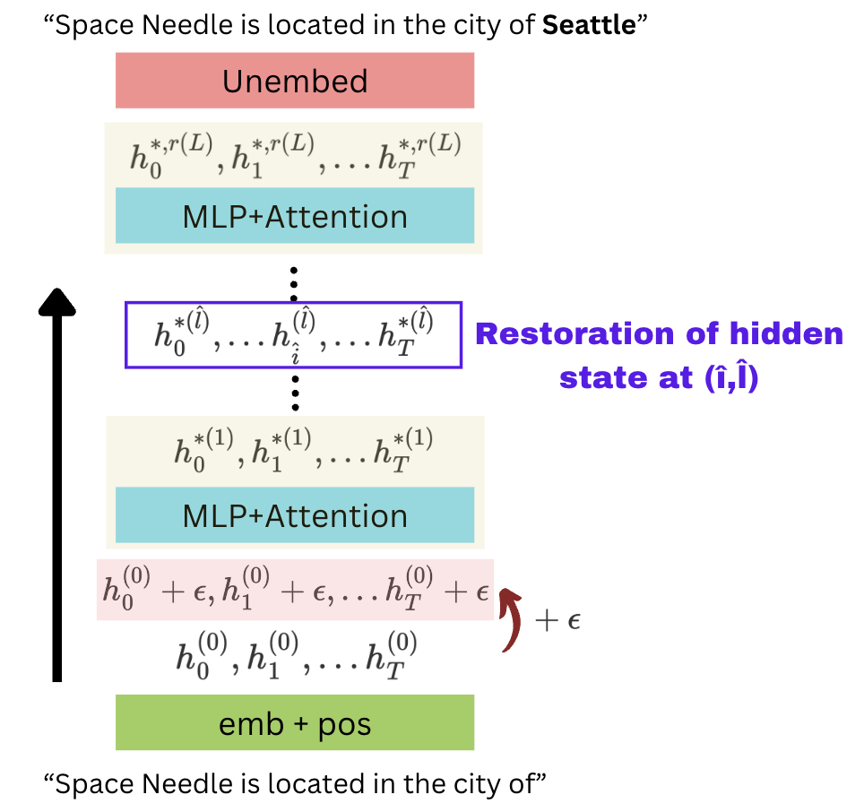
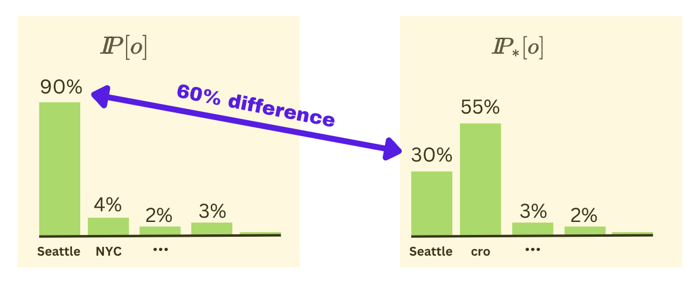
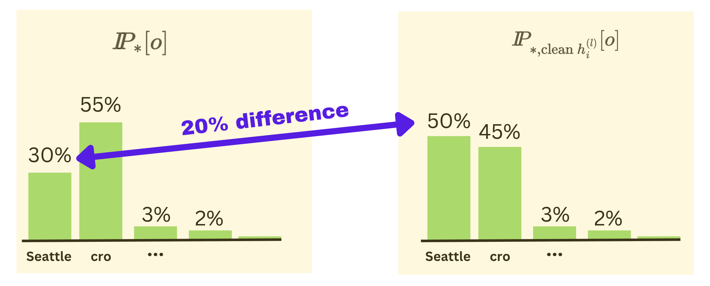

Brian Niccol became the CEO of Starbucks a few weeks ago. Unfortunately, our LLMs were trained much before this, so they might still think the CEO is Kevin Johnson. That begs the question, "How do we change facts in LLMs without retraining them every time?", or perhaps an even deeper question, "Where are facts even stored in LLMs?"

In 2022, Kevin Meng et al. wrote the paper [Locating and Editing Factual Associations in GPT](https://arxiv.org/abs/2202.05262), detailing a method to identify where facts might be stored in LLMs and utilising this information to edit the facts in LLMs without any extra training. Note that training requires extensive GPU resources, so if we could edit facts just by changing a few weights, it would be faster and more resource-efficient.

In this blog, we'll go over how a method called causal mediation analysis is applied to LLMs to locate the fact storage sites in an LLM.

### A Recap of LLM Architecture

If you don't know how transformers work, I'd recommend going over [Jay Allamar's blog post](https://jalammar.github.io/illustrated-transformer/) "The Illustrated Transformer", explaining how a transformer works in detail.

Let's assume $h_i^{(0)}$ is the hidden state before entering the transformer's first layer. So, we can represent it as the sum of the embedded input vector and the positional embeddings of the input.

 $$h_i^{(0)} = emb(x_i) + pos(i)$$

We add the attention layer output and the MLP layer output to the previous residual stream vector at every layer.

    

Here's a simplified visualisation of a single layer in the transformer network. We can see that the previous layer's hidden state for the token $i$ is denoted as $h_i^{(l-1)}$. This is inputted into the MLP layer (Multi-Layer Perceptron) to get $m_i^{(l)}$. This is added back into the hidden state (aka the residual stream), which is then passed into the attention block. The output from the attention block then goes back into the residual stream to get the hidden state of the current layer. This goes into the next layer, and the process repeats similarly.

    

We left out some details here, but that's the gist.

### Where are the facts stored in LLMs?

Now we start by attempting to locate where in LLMs facts are stored through a method called **Causal Mediation Analysis**. To implement this, we need to perform three runs: a clean run, a corrupted run, and a corrupted-with-restoration run.

    

#### 1. Clean run

Let's say we provide the string "Space Needle is located in the city of", after which we expect GPT to output "Seattle". In the clean run, no modifications were made to the LLM. The input is passed into the LLM, which predicts the next token. We'll assume there are $T$ tokens in the input.

    

The diagram shows that the input is passed into the embedder to get the embedded input. Then, the input is passed through several MLP and Attention layers. Finally, the LLM predicts the next token by unembedding the last hidden state. Since the run is clean, the output is not affected, and the factually correct output is expected ("Seattle").

#### 2. Corrupted run

In the second run, we run the same input into the embedder, but we corrupt all tokens by adding some number $\epsilon$ to each token's vector. We can see the summary in the below diagram. Naturally, corrupting the earlier layer causes all the later hidden states to be changed. We denote the corrupted hidden states by $h_i^{\*(l)}$ for token $i$ and layer $l$.

    

Due to the corruption of the embeddings before entering the first transformer layer, the output token is likely **incorrect**. The output could be meaningless too, depending on the value of $\epsilon$ (how strong the perturbation is). For example, the above diagram shows a meaningless output, "cro".

#### 3. Corrupted-with-restoration run

In the third run, we perform the corrupted run just like before, but we restore one specific token position at a particular layer ("corrupted with restoration"). Note that every other token in that layer remains corrupted.

If this restoration, followed by a forward pass, leads to the correct answer, then the specific layer and token position we restored had some significance in determining the answer.

    

#### Total Effect

Let's consider our example: "Space Needle is located in the city of Seattle".

So, the expected output is "Seattle".

 $$o = \text {“Seattle”}$$

We define the Total Effect (TE) as:

 $$\text{TE} = I\kern-0.3emP_*[o] - I\kern-0.3emP[o]$$

Here, $I\kern-0.3emP[o]$ represents the probability of outputting the "Seattle" token in the clean run, while $I\kern-0.3emP_*[o]$ represents the probability of outputting the "Seattle" token during the corrupted run. If it is high, we expect the LLM to output "Seattle"; if it is low, we expect the LLM to output a different token. For example, without corruption, "Seattle" may have a probability of 90%, but with corruption, its probability drops to 30%. Thus, we see that TE = 60%; therefore, corruption had a huge "Total Effect".

    

#### Indirect Effect

We define the indirect effect of a specific layer $\hat{l}$ and token $\hat{i}$ as:

 $$\text{IE} = I\kern-0.3emP_{*,\text{clean $h_i^{(l)}$}}[o] - I\kern-0.3emP_*[o]$$

Here, $I\kern-0.3emP_{*,\text{clean $h_i^{(l)}$}}[o]$ represents the final token probability for the "Seattle" token in the corrupted-with-restoration run, where $h_i^{(l)}$ is the restored hidden state. For example, if after corruption, the probability of "Seattle" is now 30%, but after restoring a specific layer and a specific token hidden state, the probability jumps to 50%, then that particular layer and token position has an indirect effect of 20%.

    

#### Average Total Effect (ATE) and Average Indirect Effect (AIE)

Now, we want to see which locations in the model are responsible for remembering facts in general rather than specific facts. So, we average the total effect and indirect effects across several statements. 

  <li>The larger the <strong>Average Total Effect</strong> is, the more the corruption would've <strong>degraded</strong> the output.</li>

  <li>The larger the <strong>Average Indirect Effect</strong> is, the more the restoration of a specific hidden state would've <strong>improved</strong> the output, and the more <strong>important</strong> that hidden state is.</li>

#### So what were the results?

The paper found that the Average Total Effect was 18.6% after corruption.

 $$\text{ATE} = 18.6\%$$

However, they also noticed that specific hidden states mediated much of this effect. For instance, the Average Indirect Effect of the **last subject token** at **layer 15** was 8.7%. The subject in our example is "Space Needle", and the last token is "le". So, the hidden state at this token, in layer 15, holds the largest share of the Total Effect across all hidden states.

  In English, the subject of the sentence refers to the person, place or thing that performs the action in the sentence, usually placed before the verb.

#### Separating contributions of MLP and Attention layers

They did further causal analysis to understand whether the MLP layers are more critical for factual storage or the attention layers. To do this, they perform a corrupted-with-restoration run where, after corruption of the initial hidden states, they restore only the MLP hidden state $m_\hat{i}^{(\hat{l})}$ (or only the attention hidden state $a_\hat{i}^{(\hat{l})}$). They use this to find the Indirect Effect of each MLP or Attention block.

 $$(\text{AIE of MLP})_{max} = 6.6\%$$
 $$(\text{AIE of Attn})_{max} = 1.6\%$$

The maximum Average Indirect Effect at the last subject token was 6.6% for MLP layers and 1.6% for Attention layers. Note that here, we are sticking to the last subject token, but we are maximising the AIE value across layers. It is clear that **MLP layers had a more significant causal effect than attention layers**, and they concluded from this that the MLP layers at the last subject token had something to do with factual storage. Later on, they figured out an approach to editing facts within LLMs by focusing on MLP layers at the last subject token, but we'll cover that in a later blog!

#### Conclusion and Limitations

This approach, called Causal Mediation Analysis, helps determine which parts of an LLM are in charge of which tasks. Once we know the crucial sites for specific tasks, we can target those sites for doing that task better! For example, factual associations depend more significantly on MLP layers at the last subject token. In fact, the MLPs probably act like databases, where you input a question and it retrieves the answer through a simple mapping.

There are, however, some limitations. While MLP layers seem important for factual associations, we can't infer that the other types of layers are not, and we still haven't been able to prove the exact mechanism for storing facts.

#### Acknowledgements

The contents of this blog are from the paper [Locating and Editing Factual Associations in GPT](https://arxiv.org/abs/2202.05262) by Kevin Meng et al. All diagrams were made using Canva.