

    <i>
        <a href="https://medium.com/@nikhilanandnj/" target="_blank">READ THE FULL ARTICLE ON MEDIUM</a>
    </i>

Since ChatGPT came out, I remember seeing several blogs and videos talking about this new technique called Retrieval-Augmented Generation. It worked exceedingly well in preventing hallucinations, and ensuring factually correct outputs. Since then, startups and libraries have been built just to help people optimise this process for their use cases.

What is Retrieval-Augmented Generation? RAG is a technique that uses an ability of LLMs known as **In-Context Learning**. That means that if we provide a context with some information that an LLM doesn't know, LLMs are adept at learning new information from the context and answering the question accordingly.

For example, the user asks the LLM <i>"What is the most popular language spoken in Chennai?"</i> and the LLM incorrectly outputs <i>"Hindi"</i>.

 

    

 

In a RAG setup, the LLM might retrieve a Wikipedia article saying the following:

<i>
<b>Context: </b>
Tamil is the language spoken by most of Chennai's population; English is largely spoken by white-collar workers.[145][146] As per the 2011 census, Tamil is the most spoken language with 3,640,389 (78.3%) of speakers...
</i>

Once the LLM has retrieved this from the web, it prepends this to the question and feeds it back into the LLM to get an answer.

 

    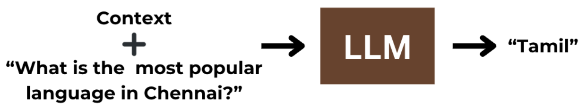

 

Providing the context leads to the correct answer, <i>"Tamil"</i>. One of the advantages of RAG is that it helps reduce hallucinations by ensuring the LLM first retrieves facts from the web and then at least gets the facts right.

But what's going on internally?

#### Causal Tracing

I wrote an [earlier blog](https://medium.com/@nikhilanandnj/where-are-facts-stored-in-large-language-models-0869914cfcbf) that explains the process of Causal Tracing in detail. I'd strongly recommend going through that (specifically the section on "Causal Mediation Analysis") before reading this blog.

Let's consider the input: "What is the most popular language in <u>Chennai</u>?"

The idea behind causal tracing is figuring out which parts of the LLM are responsible for a particular behaviour. We saw over there that facts are stored in MLPs, and the MLP at the **Last Subject Token (LST)** significantly impacts the output. In this case, "<u>Chennai</u>" is the **LST**.

In the clean case, we don't perform corruption and the LLM outputs "Hindi".

    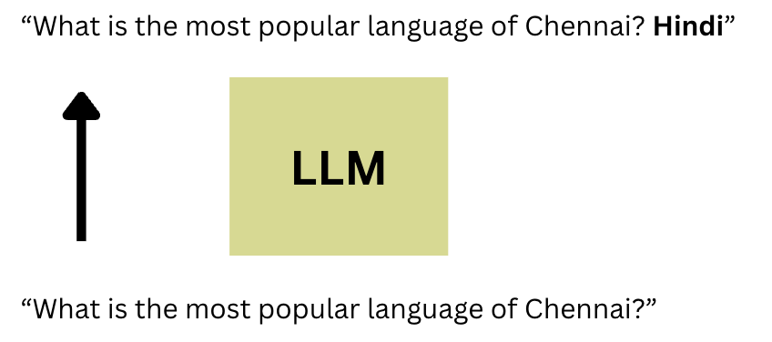

 

If we corrupt the LLM, we get the wrong output, but after restoring only the MLP at the LST, we see that the LLM brings back the original output.

    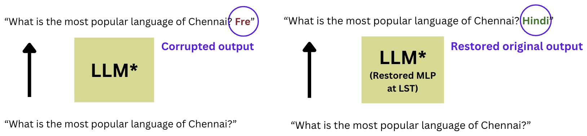

 

Restoring the MLP at the LST causes the probability of "Hindi" to rise, and we average this delta in probability over several statements, so we know it rises for multiple statements, not just one.

On the other hand, let's consider the RAG setup, which accurately outputs "Tamil" in the clean case.

    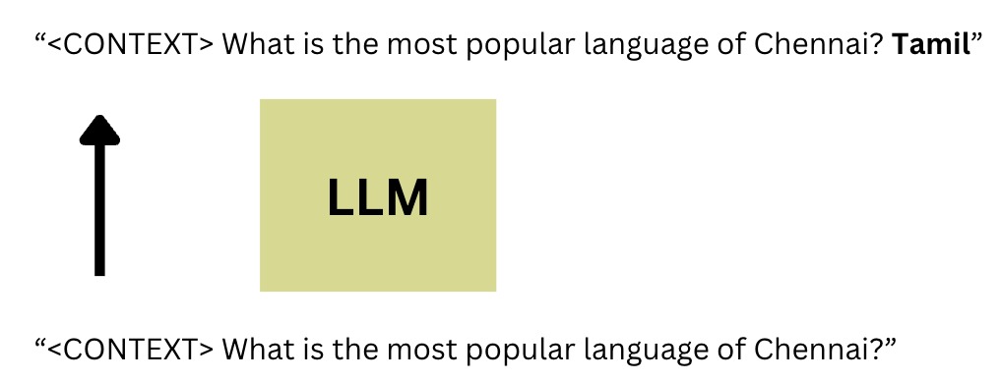

 

    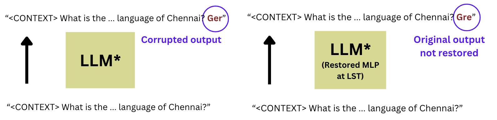

 

The hypothesis stated in our [previous blog](https://medium.com/@nikhilanandnj/where-are-facts-stored-in-large-language-models-0869914cfcbf) is that **MLPs have something to do with factual recall**. However, restoring the MLP hidden states at the LST no longer returns the original output ("Tamil"). It looks like **MLP activations aren't that important anymore**. 

That could mean the LLM is **no longer utilising its parametric memory**. This makes sense since we expect it to focus on the context rather than use its parametric memory.

<i>
<b>Finding #1:</b> In the presence of a context, LLMs minimally use the parametric memory to answer a question.</i>

So, if MLPs aren't that important anymore, what is?

#### How Attention Works in LLMs

I'd recommend going over [Jay Allamar's blog post](https://jalammar.github.io/illustrated-transformer/) "The Illustrated Transformer" to better understand how attention works.

Attention is essential in LLMs because it allows LLMs to model the meaning of words based on other words in the input. For example, an "it" later in the sentence might refer to a noun that came before, and information needs to flow from the noun to the "it" to generate the next token. Thus, some dependencies must be facilitated across tokens to get the value of the attention block's output. Here's an awesome diagram from [Jay Allamar's blog post](https://jalammar.github.io/illustrated-transformer/).

    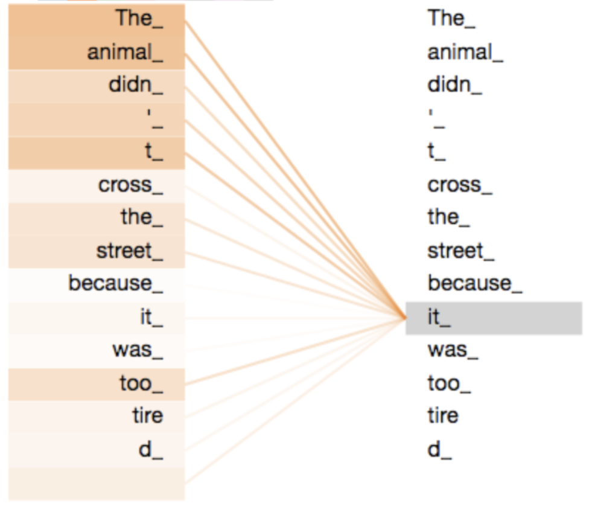
    

 

In this case, the "it" token is getting <i>enriched by the "animal" token</i>.

<!-- Let's assume that there's only one attention head in each layer (to simplify). -->

<!-- 

 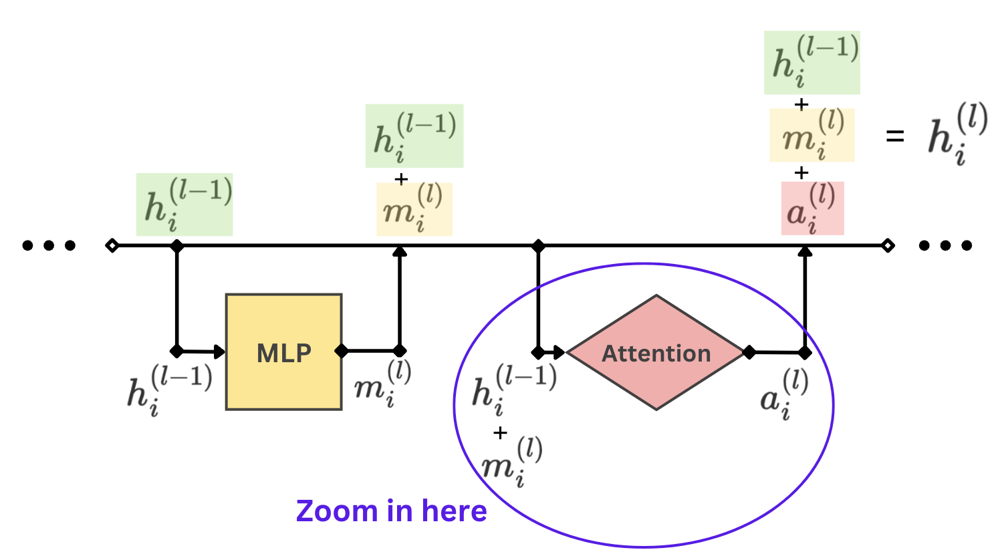

We'll assume: -->

<!-- 

 $$h_i^{(l-1)} + m_i^{(l)} = x_i^{(l)}$$

 -->

<!-- Now let's focus specifically on the attention head at layer $l$ and token position $i$. -->

<!-- 

 $$v_0^{(l)}$$
 $$q_0^{(l)}$$
 $$k_0^{(l)}$$

 -->

<!-- 

 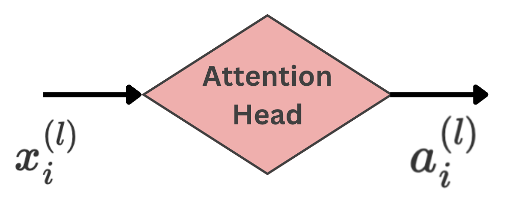

  -->

<!-- But $a_i^{(l)}$ doesn't depend only on the token position $i$. It depends on the residual stream vector $x_i$ at all token positions from $i=0$ to $N$.

Think of it this way. Consider three linear maps that map the residual vector x to three different vectors, q, k, and v.

1. Query vector q
2. Key vector k
3. Value vector v

 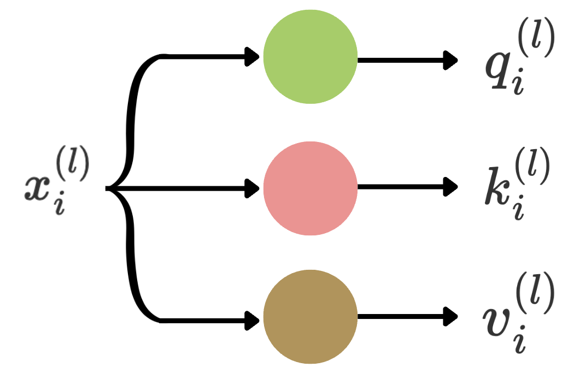

  -->

<!-- Now we'd have to apply the function to all token positions at layer l. -->

<!-- 

 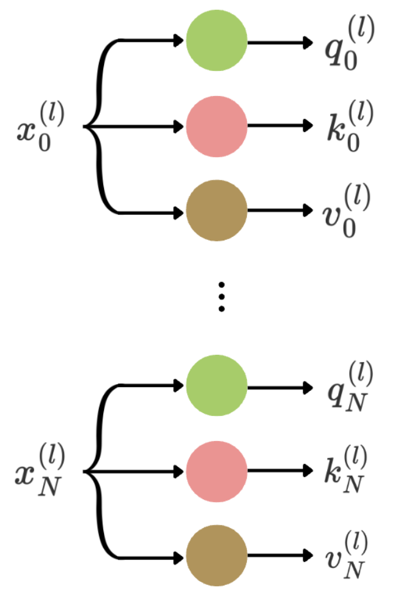

  -->

<!-- 

 $$a_i^{(l)} = (\sum_{j=0}^{N} A_{ij}^{(l)} v_{j}^{(l)})W_{out}$$

 -->

<!-- So each token position somehow uses information from all the tokens to get the output of that block. In other words, our tokens are "enriched" by the other tokens in the input. Each $A_{ij}^{(l)}$ factor represents how much token $i$ is enriched by token $j$. This is called attention, a function of the queries and keys. -->

<!-- 

 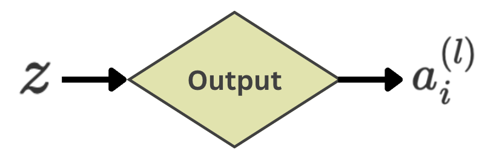

 -->

#### Attention Contributions

We can directly probe the attention values during inference. While generating the output "Tamil", we can check which tokens our final token is enriched by during this generation.

The input to the LLM is a context plus a query. From now on, AT refers to the attribute token (the "Tamil" token within the context), and ST refers to the subject token (the "Chennai" token within the query).

    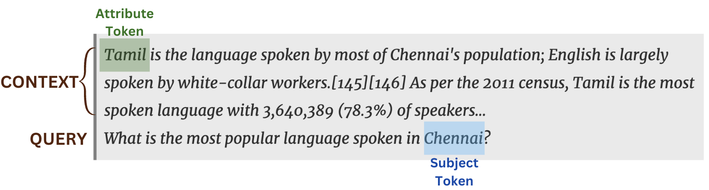
    

 

They found out that the attention to the attribute token was much larger than the attention to the subject token (averaged across several examples). That shows that the LLM used the context to answer the question.

#### Attention Knockouts

We can also perform attention knockouts to confirm the importance of the attention values. This one is similar to causal analysis, where we knock out certain attention edges and see what effect that has on the final probability distribution and output.

To knock out attention edge weights, we set the attention values to 0. Here, we ensure that the last token is **not enriched** by the context's **attribute token** ("Tamil").

 $$A_{\text{AT,N}}^{(l)} = 0$$

This significantly changes the LLM's output, causing it not to output "Tamil".

But let's say we instead ensure the last token is not enriched by the query's **subject token** ("Chennai").

 $$A_{\text{ST,N}}^{(l)} = 0$$

The LLM may still output "Tamil", showing that this time, the attention wasn't really that important.

Specifically, knocking out the attention edge to the subject token led to a 5% drop in the output probability (on average, across samples), while knocking out the attention edge to the attribute token led to a 20% drop in probability (on average).

<i>
<b>Finding #2:</b> Language models internally rely primarily on the context when it is provided to answer a question.</i>

#### Conclusions and Limitations

The main takeaway of the paper is that during a RAG setup, when a context is provided, the LLM relies much less on parametric memory and more on context to answer the question. Even though this sounds trivial, it also reinstates the fact that the memory of the LLM is somehow encoded into the MLPs and that these MLPs become a lot less critical in RAG setups. Knowing more about the mechanisms of these processes can help us further optimise the processes in various ways and help us think of ways to change the behaviour of an LLM without ever having to retrain it. For example, if lawyers couldn't use an LLM that isn't trustworthy enough to <i>always</i> output the correct answer as per the context, what if studying these attention weights and changing them in some way could force the LLM to stick to the context in a much more trustworthy fashion? Even if it's not simple, we might get there soon.

#### Acknowledgements

The contents of this blog are from the paper [From RAGs to rich parameters: Probing how language models utilise external knowledge over parametric information for factual queries](https://arxiv.org/abs/2406.12824) by Hitesh Wadhwa et al. All diagrams were made using Canva.